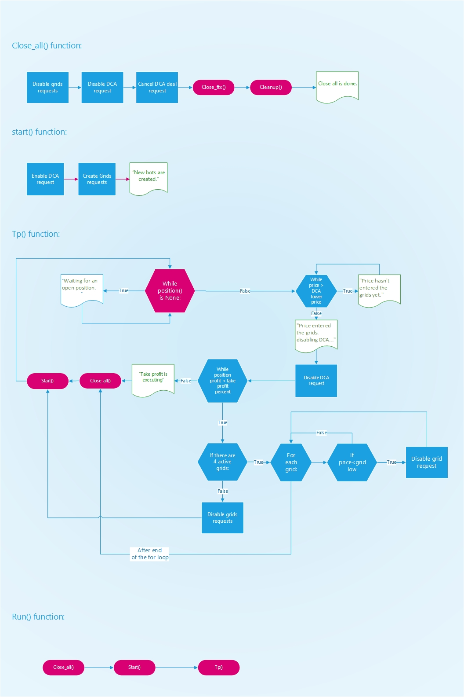

# HYBRID 3COMMAS BOT
# All new v1.0 beta is here!

They can't drop the price and range at the bottom no more!! We have a hybrid bot now. :))

What does this bot exactly do?

This is a DCA_GRID hybrid bot that creates six grid bots whose volumes are scaled from top to bottom. Each bot has specific setting assigned to it by me according to my specific money and risk management algorithm. This bot aims to profit both from mini price movements(in 0.7% range)in each grid bot and price upward movement from the mean price average.
Right now for better understanding of the mechanism you can check the code, or simply ask me. My social media handle is @blockchainophil ;)

It is mainly an open source project which combines the best of the both worlds. DCA and grid bots. The main idea is to manage the risk with dca while having the advantage of grid scalping. More information and documentation is on the way. Stay tuned!

The project is still in heavy testing. So use at your own risk.

If you like this project, please consider contributing to it.

How to use the webapp:

* fork the project
* It's a flask+celery application. If not familiar how to run it, just google it or ask me (@blockchainophil).
* Open the webapp and enter your API information.
* If you want to run and test the bot, just press run.
* If you want to clean up your unused and empty 3commas grid bots (for any purpose), click on clean up.
* If you want to close the bot you ran before, click on the close all button.
* If you want to see your open position stats, click on the position button.

Notes:
* You need 3commas and FTX accounts to run this bot.
* It opens a position on EOS-PERP by default.
* Beast mode should be enabled in 3commas settings.
* Code is compatible with heroku server out of the box. You just need to add "cloudamqp" heroku extention and configure it. more on this is in the link below: https://devcenter.heroku.com/articles/cloudamqp#installing-the-add-on
* For security reasons it doesn't yet save your credentials until the app is fully bug tested.

Code logic:

In case you want to buy me a cup of coffee or anything, here's my wallet address:
(Ethereum, Polygon and BSC networks are ok ;))

0x5931D3609b361e6d2c7729Da7Edb8797eF25458e
